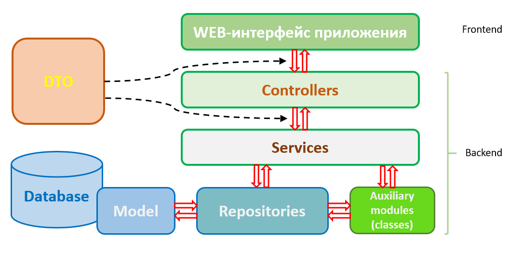
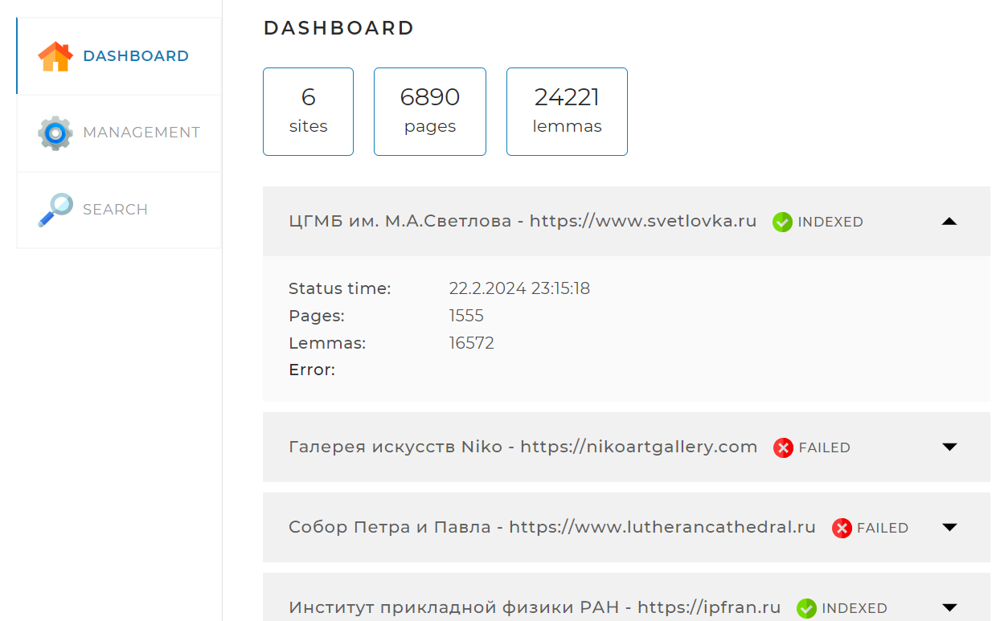
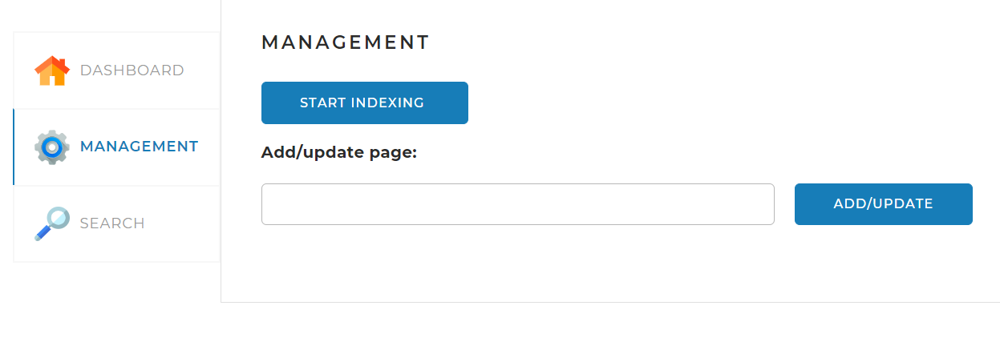
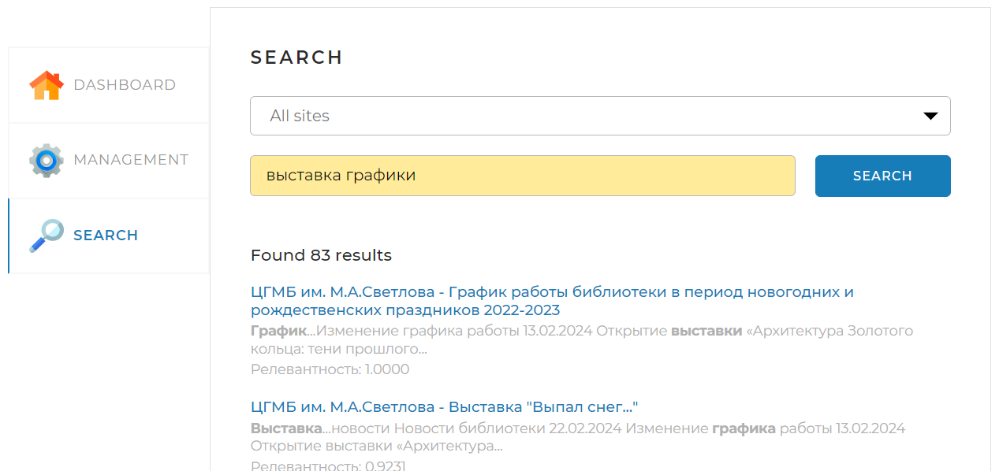

# <u>Приложение Search-Engine</u>
Индексация сайтов и поиск страниц, содержащих слова, включенные в поисковый запрос.

---

## 1. Настройки приложения
Настройки приложения содержатся в файле ___application.yaml___ и включают в себя:
#### - Настройки сервера:
После запуска приложения его интерфейс (фронтэнд) доступен по адресу ___localhost:8080___
#### - Настройки доступа к базе данных:
имя пользователя БД (___username___) и его пароль (___password___), а также URL для доступа к базе данных
#### - Настройки ORM Hibernate:
Диалект используемой СуБД (***MySQL***) и поведение системы при создании и обновлении структуры базы данных (***ddl-auto=update***) - перед запуском приложения достаточно создать в СуБД MySQL схему с именем ***search_engine_*** и предоставить пользователю, указанному в настройках доступа к БД, все права к этой схеме. Все необходимые таблицы приложение создаст само (при их отсутствии).
#### - Перечень сайтов, подлежащих индексации
Префикс ***indexing-settings***. Каждый сайт задается парой значений: адрес (***url***) и наименование (***name***)
#### - Служебные настройки для формирования http-запросов
***user-agent*** и ***referrer***

---

## 2. Структура приложения

Веб-интерфейс приложения (страница, доступная после запуска приложения по адресу ***localhost:8080/***) имеет три вкладки:

**На вкладке <u>Dashboard</u>**  представлена статистическая информация о сайтах, подлежащих индексации, а также о состоянии индексации.

**На вкладке <u>Management</u>**  представлены средства управления индексацией: кнопка запуска/остановки индексации всех сайтов, а также поле и кнопка для запуска индексации отдельной страницы (которая должна быть расположена на одном из сайтов, указанных в конфигурации)

**На вкладке <u>Search</u>**  представлены средства запуска поиска, а также результаты поиска.

В "слое контроллеров" бэкэнда приложения содержится два контроллера: **DefaultController**, обрабатывающий запрос перехода на страницу приложения (по адресу localhost:8080/) и **ApiController**, обрабатывающий "внутренние" запросы приложения (получения статистических данных из БД, запуска/остановки индексации, и т.п.).

В "слое сервисов" бэкэнда содержатся классы, обеспечивающие бизнес-логику обработки "внутренних" запросов приложения. Взаимодействие сервисов с БД осуществляется средствами SpringDataGPA (Jpa репозитории.) 

---

## 3. Используемые сторонние инструменты

1. Лемматизатор

Для приведения слов , содержащихся на индексируемых страницах, в исходную форму. В приложении используется библиотека apache.lucene.morphology, предоставленная Skillbox.

2. Стеммер

Для поиска слов, содержащихся в запросе, встречающихся на индексированных страницах в различных морфологических формах, используется стеммер Портера. В приложении использована версия с <https://github.com/vpominchuk/StemmerPorterRU/blob/master/src/stemmer/porter/ru/StemmerPorterRU.java>

---

## 4. Используемые технологии 

Используются технологии: Spring, Sql, Lombook, ForkJoin, Thread, Swagger.